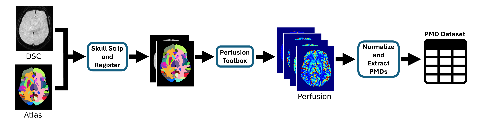

# PMD Extraction and Analysis Pipeline

<div align="center">
  
</div>

## Overview
This repository contains all the code necessary to automatically extract **Perfusion Map Descriptors (PMDs)** from **DSC-MRI** images, as described in our paper:

> *Discriminating Distal Ischemic Stroke from Seizure-Induced Stroke Mimics Using MR Perfusion Imaging*

The repository also includes scripts used for the statistical and machine learning analysis presented in the paper.

The PMD extraction pipeline is fully automated. Running `extract_PMDs.ps1` will process an entire dataset, extracting perfusion features in a reproducible manner.

## System Requirements

- **Operating system**: Windows
- **CPU**: All steps can run on standard CPUs (e.g., Intel Core i5). Though if a GPU is available you can speed up the skull stripping. 

## Dataset Requirements
For each patient, the following data is required:

1. **DSC-MRI** e.g. 2D-EPI with gadolinium-based contrast

Also needed:

1. **Brain Atlas**: e.g. The Harvard-Oxford cortical and subcortical atlas from FSL.
2. **Atlas Template**: A corresponding template for the brain atlas.

Optional:

1. **Other image types** e.g. DWI (T1 B1000) scan.

All images must be in `.nii.gz` format.

The storage location of the brain atlas and its corresponding template is flexible. You can specify their paths at the top of the `extract_PMDs.ps1` script, along with the dataset location.

Ensure your data is organized as follows:

```
dataset/
├── group_1/
│   ├── patient_1/
│   │   └── study_1/
│   │       ├── perf_nii/
│   │       │   └── perf.nii.gz
│   │       └── dwi_nii/
│   │           └── b1000.nii.gz
│   ├── patient_2/
│   │   └── study_1/
│   │       ├── perf_nii/
│   │       │   └── perf.nii.gz
│   │       └── dwi_nii/
│   │           └── b1000.nii.gz
│   └── patient_3/
│       └── ...
├── group_2/
│   └── patient_1/
│       └── study_1/
│           └── ...
└── group_3/
    └── ...
```

Each level in the hierarchy is described as follows:

- `group_X/`: A group of patients (e.g., treatment cohort, control group).
- `patient_X/`: A unique patient identifier within the group.
- `study_X/`: A study session for a patient (only add 1 study per patient).
- `perf_nii/`: Folder containing perfusion imaging data.
  - `perf.nii.gz`: Perfusion NIfTI file.
- `dwi_nii/`: Folder containing diffusion-weighted imaging data. (This could be any image type. If we can register an atlas to it, we can get PMDs for it.)
  - `b1000.nii.gz`: DWI NIfTI file.


## Installation

This pipeline uses two separate Conda environments:

### 1. Environment for Skull Stripping (HD-BET)
We use a Windows-compatible fork of HD-BET by [sh-shahrokhi](https://github.com/sh-shahrokhi/HD-BET/tree/master).
This installs hd-bet as a callable command in powershell/cmd, given the correct venv is activated.

**Installation:**
1. Create and activate a venv<br>
conda create --name hdbet python==3.11<br>
conda activate hdbet

2. Clone the forked repo<br> 
git clone https://github.com/MIC-DKFZ/HD-BET

3. Install requirements<br>
cd HD-BET (or to wherever setup.py lives)<br>
pip3 install -e .

4. Test installation<br>
hd-bet --help


### 2. Environment for PMD Processing and Analysis

**Installation:**
1. Create and activate a venv<br>
conda create --name PMD python==3.11<br>
conda activate PMD

2. Clone repo and install requirements<br>
pip3 install git+https://github.com/Marijn311/PMD_extraction_and_analysis.git

## Running the PMD Extraction Pipeline
Once installation is complete and data is prepared:

1. Open PowerShell

2. Run the extract_PMDS.ps1 script<br>
cd "location of this repo where the extract_PMDs.ps1 lives"<br>
./extract_PMDs.ps1

All patients will be processed automatically. For each patient a PMDs.xlsx file will be created.

## Error Handling
Warnings are logged automatically:<br>
Motion artifacts or unclear bolus → Logged to perfusion_tool/error_logs.txt<br>
Near zero reference value or many NaN/Inf values → Logged to error_logs.txt

## Analysis Pipeline
Once the PMDs.xlsx excel file has been created for every patients in the dataset, you can run `analysis/create_pmd_dataset.py`.<br>
This script loads all individual PMD .xlsx files and merges them into a single .nc file using xarray.

You can generate the distribution and asymmetry analysis by running `analysis/statistical_analysis.py` on the .nc file.<br>
You can train the logistic regression model using the files in `analysis/machine_learning`.
